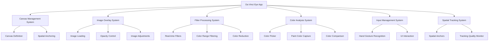

# Design Document

## Overview

The Da Vinci Eye app is a Mixed Reality application for HoloLens 2 built using Unity and the Mixed Reality Toolkit (MRTK3). The application provides artists with digital overlay capabilities to assist in fine art creation by overlaying reference images on physical canvases with adjustable opacity, filters, and color matching tools.

The app leverages HoloLens 2's spatial tracking, hand gesture recognition, and camera capabilities to create an immersive artistic assistance tool that bridges traditional art techniques with modern mixed reality technology.

## Architecture

### High-Level Architecture



### Technology Stack

- **Unity Engine**: 2021.3+ with Universal Render Pipeline (URP)
- **Mixed Reality Toolkit (MRTK3)**: Core framework for HoloLens 2 development
- **XR Interaction Toolkit**: Input handling and spatial interaction
- **Unity Input System**: Gesture and input processing
- **AR Foundation**: Camera access and spatial tracking
- **Graphics Tools**: MRTK shader and material system
- **Spatial Anchors**: Persistent world-locked positioning

## Components and Interfaces

### Core Systems

#### 1. Canvas Management System

**Purpose**: Manages the definition, tracking, and visualization of the physical canvas space.

**Key Components**:
- `CanvasDefinitionManager`: Handles canvas boundary definition and validation
- `CanvasBoundaryVisualizer`: Renders persistent visual outline of canvas
- `CanvasAnchorManager`: Manages spatial anchoring for canvas persistence

**Interfaces**:
```csharp
public interface ICanvasManager
{
    bool IsCanvasDefined { get; }
    Bounds CanvasBounds { get; }
    Transform CanvasTransform { get; }
    
    void StartCanvasDefinition();
    void DefineCanvasCorner(Vector3 position);
    void CompleteCanvasDefinition();
    void RedefineCanvas();
    event System.Action<Bounds> OnCanvasDefined;
}
```

#### 2. Image Overlay System

**Purpose**: Handles loading, displaying, and manipulating reference images on the canvas.

**Key Components**:
- `ImageOverlayManager`: Core image overlay functionality
- `ImageLoader`: Handles image loading from device storage
- `OpacityController`: Real-time opacity adjustment
- `ImageAdjustmentProcessor`: Crop, contrast, exposure, hue, saturation controls

**Interfaces**:
```csharp
public interface IImageOverlay
{
    Texture2D CurrentImage { get; }
    float Opacity { get; set; }
    bool IsVisible { get; }
    
    void LoadImage(string imagePath);
    void SetOpacity(float opacity);
    void ApplyAdjustments(ImageAdjustments adjustments);
    void SetCropArea(Rect cropRect);
    event System.Action<Texture2D> OnImageLoaded;
}
```

#### 3. Filter Processing System

**Purpose**: Applies real-time visual filters to reference images.

**Key Components**:
- `FilterManager`: Coordinates filter application and layering
- `ColorRangeFilter`: Isolates specific color ranges
- `ColorReductionFilter`: Reduces color palette complexity
- `StandardFilters`: Grayscale, edge detection, contrast enhancement

**Interfaces**:
```csharp
public interface IFilterProcessor
{
    void ApplyFilter(FilterType filterType, FilterParameters parameters);
    void RemoveFilter(FilterType filterType);
    void ClearAllFilters();
    Texture2D ProcessedTexture { get; }
    event System.Action<Texture2D> OnFilterApplied;
}
```

#### 4. Color Analysis System

**Purpose**: Provides color picking, paint analysis, and color matching capabilities.

**Key Components**:
- `ColorPicker`: Selects colors from reference images
- `PaintColorAnalyzer`: Captures and analyzes physical paint colors using HoloLens cameras
- `ColorMatcher`: Compares and provides matching guidance
- `ColorHistoryManager`: Stores color comparison sessions

**Interfaces**:
```csharp
public interface IColorAnalyzer
{
    Color PickColorFromImage(Vector2 imageCoordinate);
    Color AnalyzePaintColor(Vector3 worldPosition);
    ColorMatchResult CompareColors(Color referenceColor, Color paintColor);
    void SaveColorMatch(ColorMatchData matchData);
    event System.Action<ColorMatchResult> OnColorAnalyzed;
}
```

### UI and Interaction Components

#### 5. Input Management System

**Purpose**: Handles hand gesture recognition and UI interactions.

**Key Components**:
- `HandGestureManager`: Processes MRTK hand tracking data
- `UIInteractionManager`: Manages UI element interactions
- `GestureRecognizer`: Recognizes air tap, pinch, and drag gestures

**Integration with MRTK**:
- Uses `XRRayInteractor` for far interaction
- Uses `XRDirectInteractor` for near interaction
- Leverages `HandJointUtils` for precise hand tracking

#### 6. Spatial Tracking System

**Purpose**: Maintains accurate spatial alignment and tracking quality.

**Key Components**:
- `SpatialAnchorManager`: Creates and manages world-locked anchors
- `TrackingQualityMonitor`: Monitors HoloLens tracking performance
- `RelocalizationManager`: Handles tracking loss recovery

## Data Models

### Core Data Structures

```csharp
[System.Serializable]
public class CanvasData
{
    public Vector3[] corners;
    public Vector3 center;
    public Vector2 dimensions;
    public string anchorId;
    public DateTime createdAt;
}

[System.Serializable]
public class ImageAdjustments
{
    public Rect cropArea;
    public float contrast;
    public float exposure;
    public float hue;
    public float saturation;
    public bool isModified;
}

[System.Serializable]
public class FilterParameters
{
    public FilterType type;
    public float intensity;
    public Color targetColor;
    public float colorTolerance;
    public int targetColorCount;
    public Dictionary<string, float> customParameters;
}

[System.Serializable]
public class ColorMatchData
{
    public Color referenceColor;
    public Color capturedColor;
    public float matchAccuracy;
    public Vector3 capturePosition;
    public DateTime timestamp;
    public string notes;
}
```

### Persistent Data

- **Canvas Configurations**: Stored using Unity's `PlayerPrefs` and spatial anchor persistence
- **Image Adjustments**: Cached per session in `SessionDataManager`
- **Filter Presets**: Stored as `ScriptableObject` assets
- **Color History**: Serialized to local storage using JSON

## Error Handling

### Tracking and Spatial Errors

**Tracking Loss Recovery**:
- Implement automatic relocalization using stored spatial anchors
- Provide visual feedback when tracking quality degrades
- Graceful degradation to 2D overlay mode if spatial tracking fails

**Canvas Definition Errors**:
- Validate canvas dimensions are within HoloLens tracking bounds
- Prevent canvas definition in areas with poor spatial mesh quality
- Provide clear feedback for invalid canvas configurations

### Image Processing Errors

**Image Loading Failures**:
- Support multiple image formats (JPEG, PNG, BMP)
- Implement fallback for unsupported formats
- Provide clear error messages for corrupted files

**Filter Processing Errors**:
- Implement GPU memory management for large images
- Graceful fallback to CPU processing if GPU resources are insufficient
- Real-time performance monitoring to prevent frame rate drops

### Color Analysis Errors

**Camera Access Issues**:
- Handle camera permission denials gracefully
- Provide alternative color input methods if camera fails
- Implement lighting condition warnings for poor color capture

## Testing Strategy

### Unit Testing

**Core Systems Testing**:
- Canvas boundary calculation and validation
- Image processing pipeline accuracy
- Color analysis algorithm precision
- Filter application correctness

**Mock Dependencies**:
- Mock HoloLens camera input for color analysis testing
- Simulate spatial tracking data for canvas management testing
- Mock image loading for filter processing tests

### Integration Testing

**MRTK Integration**:
- Hand gesture recognition accuracy
- Spatial anchor persistence and retrieval
- UI interaction responsiveness
- Performance under various tracking conditions

**End-to-End Scenarios**:
- Complete canvas definition workflow
- Image overlay and adjustment pipeline
- Color matching workflow from selection to comparison
- Filter application and layering scenarios

### Performance Testing

**Rendering Performance**:
- Target 60 FPS with image overlay active
- Memory usage optimization for large reference images
- GPU shader performance for real-time filters

**Spatial Tracking Performance**:
- Anchor creation and retrieval latency
- Tracking stability under various lighting conditions
- Recovery time from tracking loss events

### Device Testing

**HoloLens 2 Specific Testing**:
- Hand tracking accuracy in various lighting conditions
- Spatial mesh quality impact on canvas definition
- Battery life impact during extended art sessions
- Thermal performance during intensive filter processing

### User Experience Testing

**Artist Workflow Validation**:
- Canvas definition ease and accuracy
- Image adjustment responsiveness and precision
- Color matching accuracy under various lighting conditions
- Filter effectiveness for different art styles and techniques